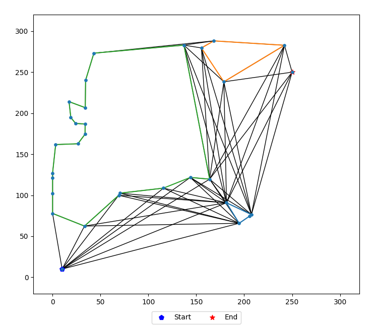
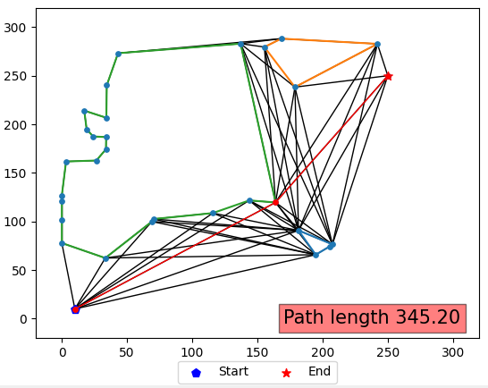
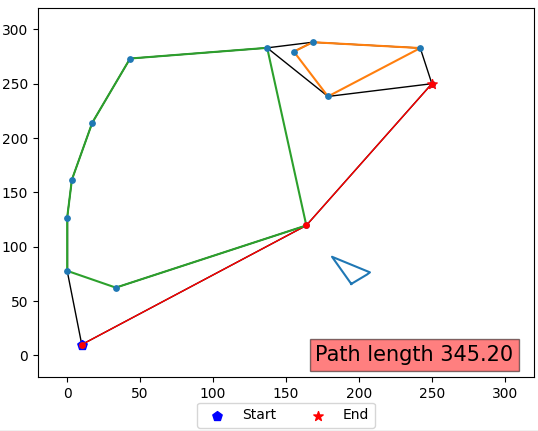
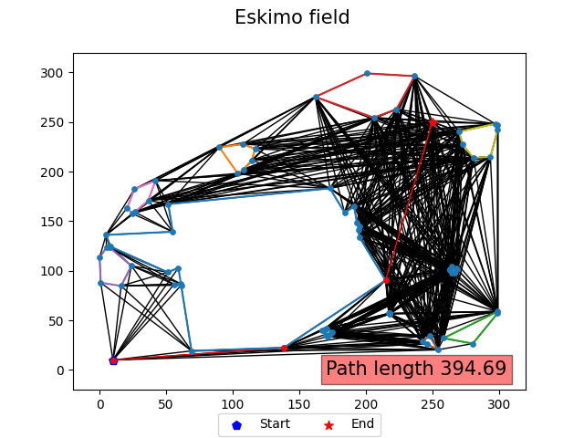
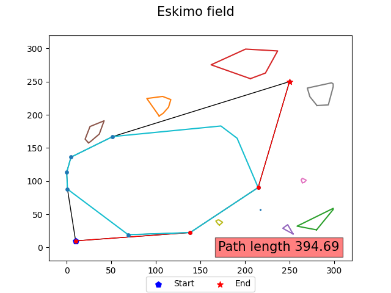

# Eskimo path  planning
### Goal - 2D problem, finding the best/shortest path (from start to end) with obstacles.

## Part 1: A review of algorithms for optimally solving the path planning problem.
- Grassfire Algorithm
- Dijkstra's Algorithm
- A* Algorithm
- D* Algorithm
- D* Lite Algorithm
- Potential Field Algorithm
- Probabilistic Road Map (PRM) Algorithm
- Rapidly Exploring Random Trees (RRT) Algorithm
- RRT* Algorithm
- LQR-RRT* Algorithm
-  [Algorithms review](project_data/algo_review.pdf)
-  [PPT FILE review](project_data/startup%20mission%20presentaion.pptx)

## Part 2: Create text file with parameters needed to the algorithm
### Input:
- field size
- starting point (x,y)
- end point (x,y)
- random polygons:
  - N - number of icebergs.
  - Dots - number of dots in each iceberg.
  - R - radius size for each iceberg.
  
### Output: text file
- field boundry (x-axis)
- field boundry (y-axis)
- x_start y_start
- x_end y_end
- Number of icebergs
- #1 (iceberg number)
- 1_dots (number of dots in iceberg #1)
- x_1 y_1
- x_2 y_2
- .....
- #2 (iceberg number)
- 1_dots (number of dots in iceberg #2)
- x_1 y_1
- x_2 y_2
- .....
- **Example**

## Part 3: Convex Hull problem (solving  with c++)
- Read the data_cpp.txt file in C++ and solve the Convex-Hull problem
- [Convex-Hull](https://en.wikipedia.org/wiki/Convex_hull)
- Possible solutions:
  - Jarvis’ Algorithm -  $O(n^2)$
  - **Graham Scan Algorithm - $O(nlog(n))$**
  - Quickhull Algorithm - $O(n^2)$
  - Divide and Conquer Algorithm - $O(nlog(n))$
  - Monotone Chain Algorithm - $O(nlog(n))$
  - Incremental Algorithm - $O(nlog(n))$
  - Kirkpatrick–Seidel Algorithm — $O(nlog(n))$
  - Chan's Algorithm — $O(nlog(n))$
- ### Graham Scan Algorithm
  - **Step 1:**
    - Find the point with the lowest y-coordinate
    
  - **Step 2:**
    - Sort the points in increasing order of the angle they and the pivot point make with the x-axis
    
  - **Step 3:**
    - Keep removing points from stack while orientation of following 3 points is not counterclockwise (or they don’t make a left turn). 
    
    
      
- **Performing Graham Scan Algorithm for all  polygons we created in the previous step:**   
  - 

## Part 4: path planning solution
  - **Step 1: Create Graph**
    - Using networkx library.
    - 2 option to create graph:
      - Naive ++ way- using all the grid (size*size)
      ## Naive way: all vertexes available
        - Union of the polygons that touch each other. (**not convex** shape)
        - Connect all points in the field. (need to check if possible to connect)
        
      
      ## Optimal way:  create graph only with the relevant convex shape.
        1. Union of the polygons that touch each other. (**convex** shape)
        2. If start/end point inside the union polygons - go to naive solution...
        3. Recursive_algorithm(start_point):
          - If a straight line can be connected between the point and the end - done.
          - else:
            - p = Find the polygon that is between the start point and the end point.
            - Do ConvexHull(start, end, p)
            - s_left, s_right = 2 points on the new polygon that are on either side of the starting point.
            - Recursive_algorithm(s_left)
            - Recursive_algorithm(s_right)
           
      **Example GIF**
    
      
    
    
  - **Step 2:**
    - Solve the path planning algorithm on this graph (A*, Dijkstra, etc.)
      - Example 1:
        - 
        - 
      - Example 2:
        - 
        - 
  
## Part 5: Dubbins model

  
  
  
