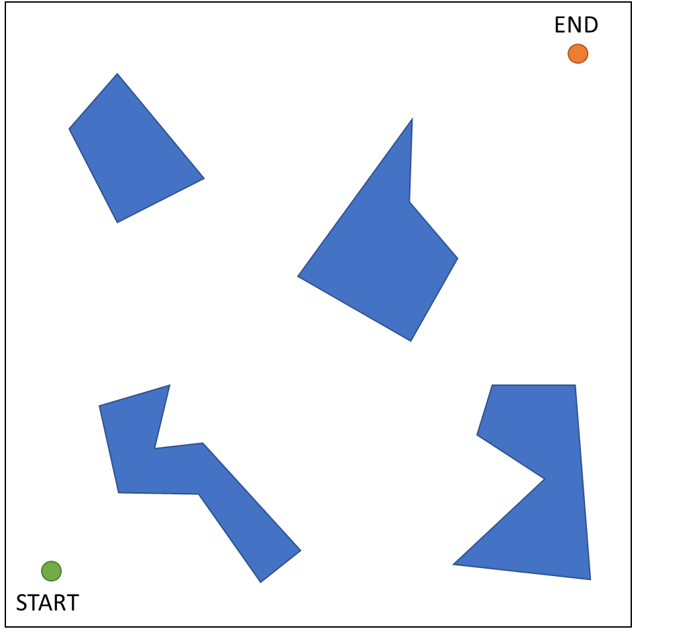

# Eskimo path  planning
### Goal - 2D problem, finding the best/shortest path (from start to end) with obstacles.

## part 1: A review of algorithms for optimally solving the path planning problem.
-  [Algorithms review](https://github.com/amtbuzii/Eskimo_path_planning/blob/main/startup%20mission%20presentaion.pdf)

## part 2: Create text file with parameters needed to the algorithm
### Input:
- field size
- starting point (x,y)
- end point (x,y)
- random polygons:
  - N - number of icebergs.
  - Dots - number of dots in each iceberg.
  - R - radios size for each iceberg.
  
### Output: text file
- field boundry (x-axis)
- field boundry (y-axis)
- x_start y_start
- x_end y_end
- Number of icebergs
- #1 (iceberg number)
- 1_dots (number of dots in iceberg #1)
- x_1 y_1
- x_2 y_2
- .....
- #2 (iceberg number)
- 1_dots (number of dots in iceberg #2)
- x_1 y_1
- x_2 y_2
- .....

## part 3: Convex Hull problem (solving  with c++)
- Read the data_cpp.txt file in C++ and solve the Convex-Hull problem
- [Convex-Hull](https://en.wikipedia.org/wiki/Convex_hull)
- Possible solutions:
  - Divide and Conquer Algorithm - $O(n*log(n))$
  - Jarvis’ Algorithm -  $O(n^2)$
  - Graham Scan Algorithm - $O(n*log(n))$
  - $\sqrt{3x-1}+(1+x)^2$
  

## part 4: path planning solution - A*

## part 5: Dubbins model

  
  
  
