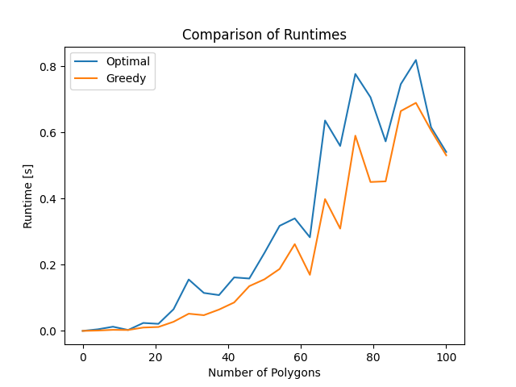
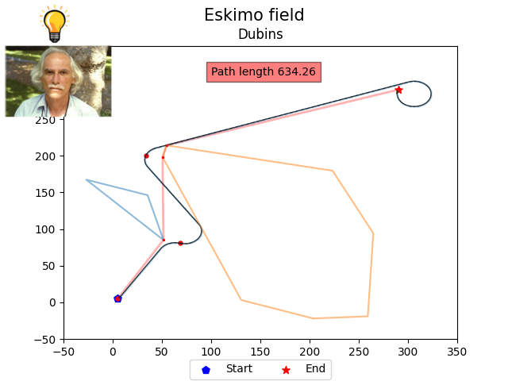
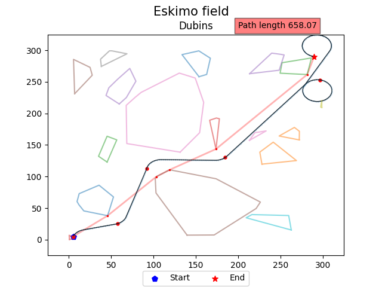

# Eskimo path  planning exercise

### The objective is to solve a 2D problem by determining the optimal or most efficient route, from the starting point to the destination while navigating around obstacles.

## Section 1: An examination of techniques aimed at achieving optimal solutions to the path planning challenge:
- Grassfire Algorithm
- Dijkstra's Algorithm
- A* Algorithm
- D* Algorithm
- D* Lite Algorithm
- Potential Field Algorithm
- Probabilistic Road Map (PRM) Algorithm
- Rapidly Exploring Random Trees (RRT) Algorithm
- RRT* Algorithm
- LQR-RRT* Algorithm
- [Algorithms review](project_data/algo_review.pdf)
- [PPT FILE review](project_data/startup%20mission%20presentaion.pptx)

## Section 2: Generate a text file containing all the required parameters for the algorithm to execute.

### Input:

- Field size
- Start position (x,y)
- End position (x,y)
- Polygons parameters:
    - N - number of icebergs.
    - Dots - number of dots in each iceberg.
    - R - radius size for each iceberg.

### Output: text file

- Field boundry (x-axis)
- Field boundry (y-axis)
- x_start y_start
- x_end y_end
- Number of icebergs
- #1 (iceberg number)
- 1_dots (number of dots in iceberg #1)
- x_1 y_1
- x_2 y_2
- .....
- #2 (iceberg number)
- 1_dots (number of dots in iceberg #2)
- x_1 y_1
- x_2 y_2
- .....
- **Output example**
  

## Section 3: Convex Hull problem

- Read the field_data.txt file and solve the [Convex-Hull](https://en.wikipedia.org/wiki/Convex_hull) problem.
- Possible solutions:
    - Jarvis’ Algorithm - $O(n^2)$
    - **Graham Scan Algorithm - $O(nlog(n))$**
    - Quickhull Algorithm - $O(n^2)$
    - Divide and Conquer Algorithm - $O(nlog(n))$
    - Monotone Chain Algorithm - $O(nlog(n))$
    - Incremental Algorithm - $O(nlog(n))$
    - Kirkpatrick–Seidel Algorithm — $O(nlog(n))$
    - Chan's Algorithm — $O(nlog(n))$
- ### Graham Scan Algorithm
    - **Step 1:**
        - Identify the point with the minimum y-coordinate.
          
    - **Step 2:**
        - Arrange the points in ascending order based on the angle they form with the x-axis, with respect to the pivot point.
          
    - **Step 3:**
        - Remove points from the stack until the orientation of the next three points is not clockwise (or they do not make a right turn).
          

- **Execute the Graham Scan Algorithm for all the polygons-points generated in the preceding step:**
    - 

## Section 4: Path planning solution
The path planning process consists of two stages.
The first phase involves creating a graph, while the second stage entails 
determining the most efficient path on that graph.

- **Step 1: Creating a graph (using networkx library)**
    - There exist multiple techniques for graph construction:
        - **Grid** approach.
        - **Naive** approach.
        - **Greedy** approach.
        - **Optimal** approach.
        - **Random** approach.
      
      ## Naive approach: including all available nodes and vertices.
        1. Union of polygons that share a common boundary. (**not convex** polygon)
        2. Connect all possible nodes in the field while also ensuring collision detection and avoidance.

      
  
      ## Greedy approach: select the shortest path to traverse the polygon.
        1. Union of polygons that share a common boundary. (inflation **convex** polygon)
            - **If** the starting or ending point is located inside the union of polygons, then the simple approach of including all available nodes and vertices should be used.
        2. Recursive_algorithm(start_point):
            - If it is possible to draw a straight line between the starting and ending points:
                - Done.
            - else:
                - p = first polygon that lies between the starting point and the ending point.
                - Do ConvexHull(start, end, p)
                - s_left, s_right = Identify two points on the new polygon that are positioned on opposite sides of the starting point.
                - Split the polygon into two smaller polygons and calculate their perimeters.
                - If the left_side is shorter:
                    - Recursive_algorithm(s_left)
                - else:
                    - Recursive_algorithm(s_right)
        

      ## Optimal approach: generating a graph solely based on the relevant convex shapes.
        1. Union of polygons that share a common boundary. (inflation **convex** polygon)
            - **If** the starting or ending point is located inside the union of polygons, then the simple approach of including all available nodes and vertices should be used.
        2. Recursive_algorithm(start_point):
            - If it is possible to draw a straight line between the starting and ending points:
                - Done.
            - else:
                - p = first polygon that lies between the starting point and the ending point.
                - Do ConvexHull(start, end, p)
                - s_left, s_right = Identify two points on the new polygon that are positioned on opposite sides of the starting point.
                - Recursive_algorithm(s_left)
                - Recursive_algorithm(s_right)
    
  **Optimal approach GIF**
  

      ## Random approach: generate a graph in a random manner. (RRT/RRT*)
      1. Union of polygons that share a common boundary. (**not convex** polygon)
      2. Execute the following steps K number of times:
         - Generate a random point.
         - Determine the neighboring points for this randomly generated point and order them in a list.
         - Create a new node between the closest neighboring point and the random point, using a specified step size.
         - If the new node is in proximity to the target point or has reached it:
           - Done!
        

- **Step 2:**
    - Utilize path planning algorithms such as A* or Dijkstra's algorithm to solve the path planning problem on this graph.
## Example #1

## Example #2

  # Performance Analysis

  ### Runtime analysis

*****************************************

  ### Comparison (100 attempts):

## Path length: 
* direct line $≈410.122$
1. **Naive** $\mu=415.34$, $\sigma=11.26$
2. **Optimal** $\mu=416.93$, $\sigma=12.96$
3. **Greedy** $\mu=418.64$, $\sigma=13.33$
4. **Random** $\mu=589.17$, $\sigma=54.56$

* **Dubins** $\mu=648.77$, $\sigma=200.65$

## Runtime [s]: 
1. **Greedy** $\mu=0.0423$, $\sigma=0.008$
2. **Optimal** $\mu=0.085$, $\sigma=0.243$
3. **Naive** $\mu=3.513$, $\sigma=0.442$
4. **Random** $\mu=24.165$, $\sigma=4.52$

* **Dubins** $\mu=0.374.77$, $\sigma=0.14$

## Part 5: Dubins model

- Lester Eli Dubins (1920–2010) demonstrated in 1957 that the shortest path can be achieved by connecting circular arcs with maximum curvature and straight lines.
- The Dubins model is commonly employed in robotics and motion planning to simplify the description of a vehicle's motion with a fixed turning radius.
- According to the model, the vehicle is restricted to moving in a straight line forwards or backwards, and can only make turns with a consistent radius.

- The parameters in the Dubins model are as follows:
  - **velocity** = constant velocity
  - **phi** = maximum allowable roll angle

- The radius of the turn can calculate by:
  -  $r={v^{2} \over {g\tan \theta }}$
  
- Assumes a constant gravitational acceleration of  (g=9.8 m/s²).

### Dubins algorithm:

1. Compute the optimal path.
2. Update the path:
   - Increase the distance from the obstacle by a constant value (bisector angle). 
   - Remove redundant points (close points).
3. Determine the angle between each point and the next point in the path. 
4. Calculate all six Dubins paths (RSR, LSL, etc.). 
5. Sort the paths based on their lengths. 
6. For each edge, select the shortest collision-free path.

## Example #1

## Example #2

## GUI
* using [CustomTkinter](https://github.com/TomSchimansky/CustomTkinter) by Tom-Schimansky

## TBD
* Collision detection process improvements:
  * Use efficient data structures like octrees or BVHs.
  * Implement bounding volumes to quickly discard non-colliding pairs.
  * Employ hierarchical collision detection techniques.
  * Utilize parallel processing for faster computations.

* Random method - step size/dynamic step size:
  * Choose a fixed step size or use a dynamic step size approach.
  * Dynamic step size can start large and decrease gradually for accuracy and convergence.

* Random method - how to generate new points:
  * Use uniform distribution for random point generation throughout the search space.
  * Consider target-focused distribution using techniques like importance or adaptive sampling.

* Dubins - finding a closer solution when no optimal length exists:
  * Relax constraints or introduce penalties in the optimization objective.
  * Modify the cost function or introduce soft constraints.
  * Employ heuristic methods like sampling-based algorithms or optimization techniques to find a feasible solution closer to the goal.

  
