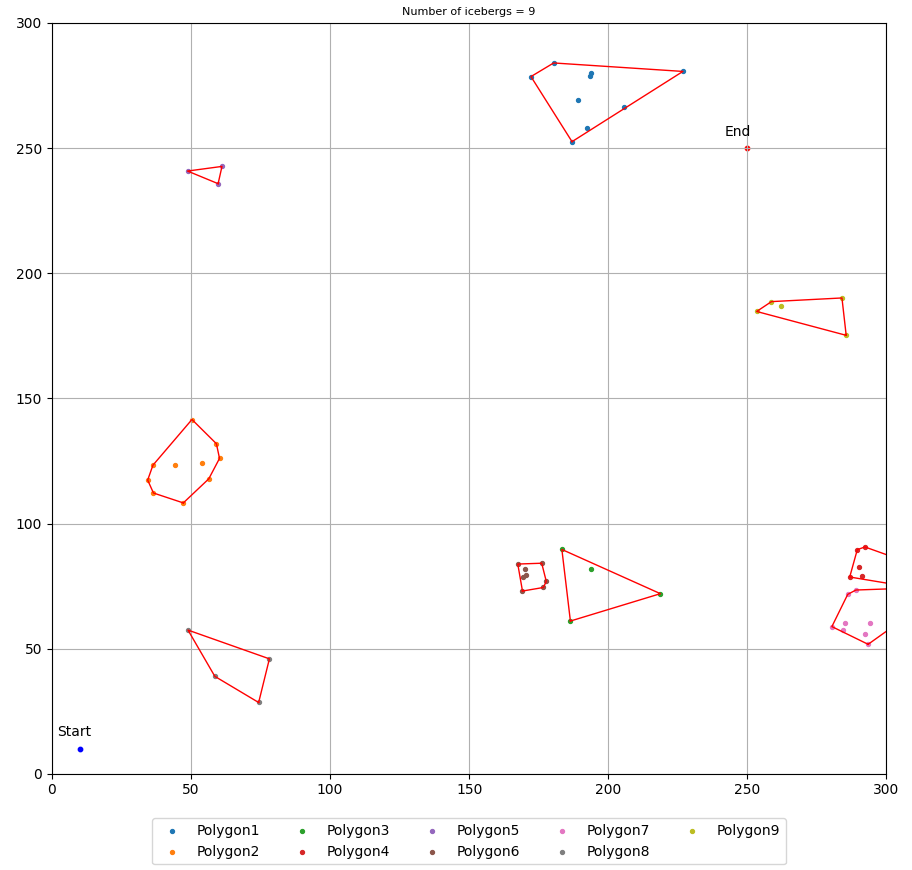
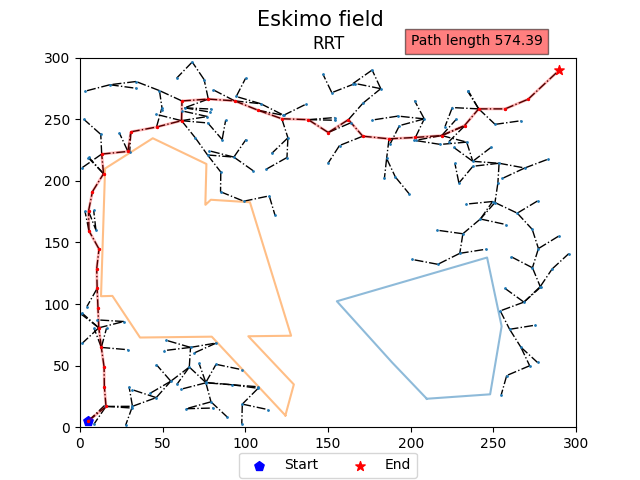
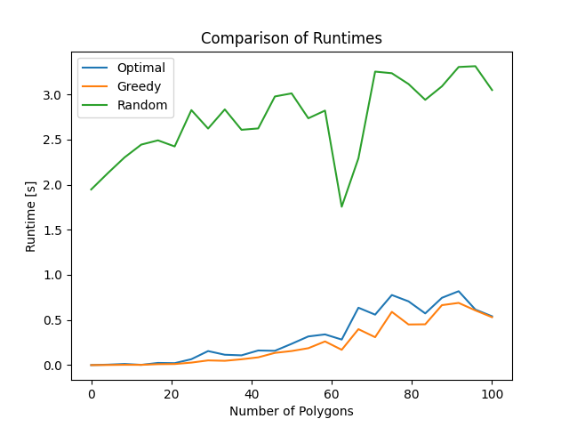
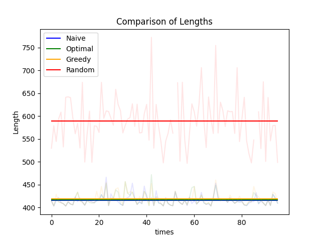
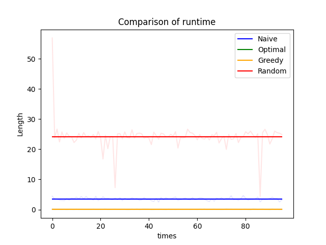
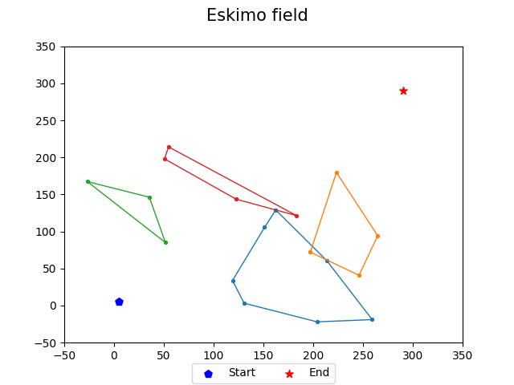
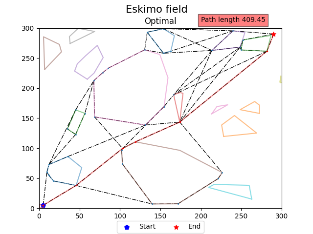

# Eskimo

Find the best path from A to B while avoiding obstacles in a 2D environment.

**Amit Bouzaglo** - [GitHub](https://github.com/amtbuzii/Eskimo_path_planning)

---

---
## Path planning algorithms review:
    - Grassfire Algorithm
    - Dijkstra's Algorithm
    - A* Algorithm
    - D* Algorithm
    - D* Lite Algorithm
    - Potential Field Algorithm
    - Probabilistic Road Map (PRM) Algorithm
    - Rapidly Exploring Random Trees (RRT) Algorithm
    - RRT* Algorithm
    - LQR-RRT* Algorithm

[PDF](https://github.com/amtbuzii/Eskimo_path_planning/blob/main/project_data/algo_review.pdf)

---
## Generate field  

 Input:

    - Field size
    - Start position (x,y)
    - End position (x,y)
    - Polygons parameters:
        - N - number of icebergs.
        - Dots - number of dots in each iceberg.
        - R - radius size for each iceberg.

---

### Convex Hull
* Jarvis’ Algorithm - $O(n^2)$
* Quickhull Algorithm - $O(n^2)$
* Divide and Conquer Algorithm - $O(nlog(n))$
* Monotone Chain Algorithm - $O(nlog(n))$
* Incremental Algorithm - $O(nlog(n))$
* Kirkpatrick–Seidel Algorithm — $O(nlog(n))$
* Chan's Algorithm — $O(nlog(n))$
* **Graham Scan Algorithm - $O(nlog(n))$**

---

-  **Graham Scan Algorithm**
    - Pivot - minimum y-coordinate.
    - Sort points by angle with pivot.
    - Initialize stack with pivot point.
    - Iterate - for each point:
        - Push point onto stack.
        - removing points until a counterclockwise orientation is obtained.
    - The remaining points on the stack form the convex hull.
---

---

## Path planning solution

1. Creating a graph: (using networkx library)
    - Gr**i**d approach (not implemented).
    - Naive approach.
    - Gr**ee**dy approach.
    - Optimal approach.
    - Random approach.

2. Once the graph is prepared, determine the optimal path:
    - Dijkstra, A*, etc.

---   
### Naive approach:
Including all available nodes and vertices.
1. Union polygons.
2. Connect all possible nodes in the field while also ensuring collision detection and avoidance.

---
### Greedy approach:
* The shortest path to traverse the polygon:
    1. Union polygons.
    2. Recursive algorithm.

           
---
## Greedy approach algorithm

    def greedy(start, end):
        -if it is possible to draw a straight line:
            - Done.
        -else:
            - p = first polygon that lies between the starting point and the ending point.
            - Do ConvexHull(start, end, p)
            - s_left, s_right = Identify two points on the new polygon 
            - split the polygon into two polygons:
                - If the left_side perimeter is shorter:
                    - greedy(s_left)
                - else:
                    - greedy(s_right)

---
### Optimal approach:
1. Union polygons.
2. Recursive algorithm.

---
## Optimal approach algorithm
    def optimal_path(start, end):
    - if it is possible to draw a straight line:
        - Done.
    - else:
        - p = first polygon that lies between the starting point and end point.
        - Do ConvexHull(start, end, p)
        - s_left, s_right = Identify two points on the new 
          polygon that are positioned on opposite sides of the starting point.
        - optimal_path(start, s_left), optimal_path(s_left, end)
        - optimal_path(start, s_right), optimal_path(s_right, end)
---

---

## Random approach
Generate a graph in a random manner. (RRT)
1. Union polygons.
2. do K times:
    - Generate a valid random point.
    - Find closet neighbor.
    - Create a new node between both. (step size)

---

Example

---

Example

---
# Performance Analysis
* Runtime
* Length

---

---

---

### Comparison
*  100 attempts

---

## Path length: 
* direct line $≈410.122$

1. **Naive** $\mu=415.34$, $\sigma=11.26$
2. **Optimal** $\mu=416.93$, $\sigma=12.96$
3. **Greedy** $\mu=418.64$, $\sigma=13.33$
4. **Random** $\mu=589.17$, $\sigma=54.56$

**Dubins** $\mu=648.77$, $\sigma=200.65$

---

---

## Runtime [s]: 
1. **Greedy** $\mu=0.0423$, $\sigma=0.008$
2. **Optimal** $\mu=0.085$, $\sigma=0.243$
3. **Naive** $\mu=3.513$, $\sigma=0.442$
4. **Random** $\mu=24.165$, $\sigma=4.52$

* **Dubins** $\mu=0.374.77$, $\sigma=0.14$

---
## Dubins model

- Lester Eli Dubins (1920–2010)
- Model parameters:
  - **velocity**  $v$ = constant velocity
  - **phi** $\phi$ = maximum allowable roll angle

- The radius of the turn can be calculated by:
  -  $r={v^{2} \over {g\tan \phi }}$
  
- Assumes a constant gravitational acceleration of  (g=9.8 m/s²).
---
### Dubins algorithm:

1. Compute the optimal path.
2. Update the path:
   - Increase the distance from the obstacle by a constant value (bisector angle). 
   - Remove redundant points (close points).
3. Determine the angle between each point and the next point in the path. 
4. Calculate all six Dubins paths (RSR, LSL, etc.). 
5. Sort the paths based on their lengths. 
6. For each edge, select the shortest collision-free path.
---
## Example

---

---

---

---

---
## Example #2

---

--- 
* Collision detection process improvements:
    * Use efficient data structures (BVHs or Octrees).
    * Employ hierarchical techniques and parallel processing.

* Random method:
    * Step size (fixed or dynamic).
    * Uniform or target-focused distribution.

* Dubins - finding a closer solution:
    * Utilize heuristics for feasible solutions.

    

---

---

## Code

---

---
## GUI

*  [CustomTkinter](https://github.com/TomSchimansky/CustomTkinter)

---

# Questions?

Thank you

---
    * Pseudorandom number generator
    * Rejection sampling
    * Git
    * *.MD file
    * pre-commit - hook, black, linter, flake
    * logger
    * Python libary: numpy, networkx, shapley, matplotlib, itertools
    * Exception Handling
    * Dependency injection
    * unitest
    * Debugging process
    * requirments.txt
    * Performance analysis

